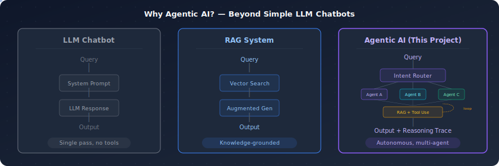
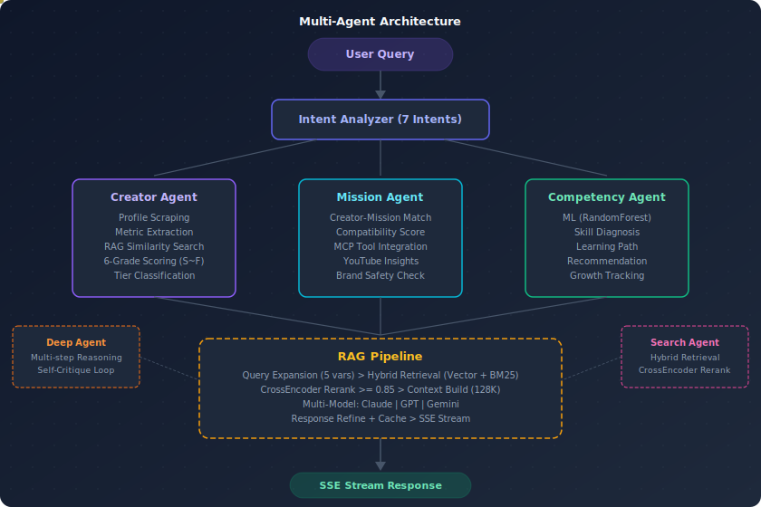
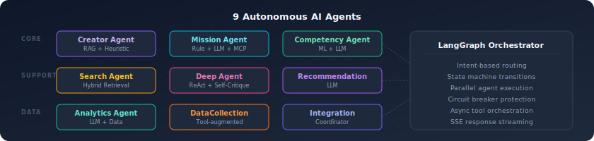
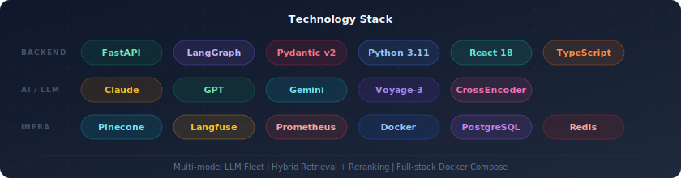

<p align="center">
  
</p>

<p align="center">
  <a href="#quick-start"></a>
  <a href="#api-reference"></a>
  <a href="#roadmap"></a>
  <a href="LICENSE"></a>
</p>

<p align="center">
  <strong>An autonomous multi-agent system that evaluates social media creators, scores their influence, and matches them with brand campaigns — powered by LangGraph, RAG pipelines, and multi-model LLMs.</strong>
</p>

> **Proof of Concept** — This repository is a PoC (Proof of Concept) demonstrating the architecture and core capabilities of an AI-powered creator onboarding system. Creator Evaluation, Mission Recommendation, and RAG-based Q&A are fully functional. Production development will continue in a separate repository. See [Project Status](#project-status) for details.

---

## Table of Contents

- [Project Status](#project-status)
- [Why Agentic AI?](#why-agentic-ai)
- [Architecture](#architecture)
- [Creator Evaluation System](#creator-evaluation-system)
  - [Data Collection](#data-collection)
  - [Scoring System](#scoring-system)
  - [Grading & Decision](#grading--decision)
- [Agent Ecosystem](#agent-ecosystem)
- [Tech Stack](#tech-stack)
- [Quick Start](#quick-start)
- [API Reference](#api-reference)
- [Project Structure](#project-structure)
- [Roadmap](#roadmap)
- [Contributing](#contributing)
- [License](#license)

---

## Project Status

This repository serves as a **Proof of Concept (PoC)** — a working prototype that validates the system architecture and demonstrates core capabilities. Production-level development will continue in a separate repository.

### What works in this PoC

| Feature | Status | Description |
|:--------|:------:|:------------|
| **Creator Evaluation** | Working | Instagram profile scraping, 5-category scoring, 6-grade system |
| **Mission Recommendation** | Working | Rule-based creator-mission matching engine |
| **RAG Pipeline** | Working | Hybrid retrieval + reranking + streaming generation (requires API keys) |
| **LangGraph Orchestrator** | Working | 14-node graph with intent routing, planning, and multi-agent dispatch |
| **Multi-Model LLM Fleet** | Working | Claude + GPT + Gemini with automatic failover |
| **Frontend UI** | Working | React 18 evaluation dashboard, RAG chat, admin panel |
| **Docker Deployment** | Working | Full-stack Docker Compose (6 services) |
| **Auth / RBAC** | Working | JWT tokens, role-based access, refresh flow |

### Prototype / partial implementation

| Feature | Status | Notes |
|:--------|:------:|:------|
| **Analytics Agent** | Prototype | Returns sample data for UI demonstration |
| **GraphRAG** | Prototype | Simulated graph-based retrieval |
| **TikTok / YouTube scraping** | Limited | Requires JS rendering not yet implemented |
| **Test Coverage** | ~30% | Target: 95% (to be achieved in production repo) |

### What's next (separate repository)

Production development will address:
- Official platform API integrations (OAuth-based)
- Real engagement metrics collection
- Kubernetes deployment with auto-scaling
- Comprehensive test coverage (95%+)
- Batch processing for large-scale creator evaluation
- Campaign automation workflows

---

## Why Agentic AI?

This system goes beyond simple chatbots or RAG pipelines. It autonomously reasons, routes tasks to specialized agents, uses external tools, and iterates on its own output through self-critique loops.

<p align="center">
  
</p>

| Capability | LLM Chatbot | RAG System | **This Project** |
|:-----------|:-----------:|:----------:|:----------------:|
| Knowledge grounding | — | Vector DB | Vector + BM25 + Reranking |
| Tool use | — | — | MCP, YouTube, Web Scraping |
| Multi-step reasoning | — | — | ReAct + Self-Critique |
| Autonomous routing | — | — | Intent Analyzer (7 types) |
| Structured scoring | — | — | 5-category weighted system |
| Multi-model fallback | — | — | Claude + GPT + Gemini |

---

## Architecture

<p align="center">
  
</p>

The system uses a **LangGraph-based orchestrator** that routes user queries through an intent analyzer to specialized domain agents. Each agent can independently access tools, perform scraping, query vector databases, and generate structured outputs.

**Key design decisions:**

- **Intent-based routing** — A classifier agent determines which domain agent(s) should handle each query, supporting 7 distinct intent types
- **Hybrid retrieval** — Combines vector similarity (Pinecone + Voyage-3) with keyword matching (BM25) and CrossEncoder reranking (threshold >= 0.85)
- **Multi-model LLM fleet** — Requests are routed to Claude, GPT, or Gemini based on task type, with automatic failover
- **SSE streaming** — All long-running operations stream results in real-time via Server-Sent Events
- **Circuit breaker protection** — External API calls are wrapped with circuit breakers to handle upstream failures gracefully

---

## Creator Evaluation System

The core feature of this project. Given only a social media handle, the system automatically scrapes the profile, extracts metrics, runs multi-criteria scoring, and produces a structured evaluation report.

<p align="center">
  
</p>

### Data Collection

Profile data is extracted from Instagram's `og:description` meta tag, providing **verified** follower/following/post counts without API keys or authentication.

| Data Point | Method | Confidence |
|:-----------|:-------|:-----------|
| Followers | `og:description` parsing | `verified` — directly from profile |
| Following | `og:description` parsing | `verified` |
| Total Posts | `og:description` parsing | `verified` |
| Display Name | `og:title` parsing | `verified` |
| Engagement Rate | Platform benchmark estimation | `estimated` — no login access |
| Post Frequency | Total posts / account age | `estimated` |
| Bio Text | JSON structure parsing | `verified` (when available) |

**Scraping chain:** Supadata MCP (primary) → HttpMCP (fallback) → og:description → JSON pattern → regex

```
og:description example:
"90K Followers, 3,368 Following, 558 Posts - Dem Jointz (@demjointz)..."
     ↓ parsed
followers: 90,000  [verified]
following: 3,368   [verified]
total_posts: 558   [verified]
```

> **Data confidence transparency** — Every metric in the API response is tagged with its source (`verified`, `estimated`, or `unavailable`). The frontend displays corresponding badges so users always know which data points are confirmed vs. estimated.

### Scoring System

Each creator is scored across **5 independent categories** with configurable weights that auto-normalize to sum = 1.0.

<p align="center">
  
</p>

| Category | Weight | Max | Scoring Criteria | Source |
|:---------|:------:|:---:|:-----------------|:------:|
| **Followers** | 35% | 35 | 7-tier classification (Mega → Rising) | verified |
| **Engagement** | 25% | 25 | Platform benchmark comparison | estimated |
| **Activity** | 15% | 15 | Post frequency (0.5/day = max) | estimated |
| **FF Ratio** | 10% | 10 | Following/follower health indicator | verified |
| **Brand Fit** | 15% | 15 | External brand compatibility score | input |

All weights are externalized in `config/settings.py` and can be overridden via environment variables:

```python
# config/settings.py — auto-normalizes to sum = 1.0
CREATOR_WEIGHT_FOLLOWERS = 0.35
CREATOR_WEIGHT_ENGAGEMENT = 0.25
CREATOR_WEIGHT_ACTIVITY = 0.15
CREATOR_WEIGHT_FF_RATIO = 0.10
CREATOR_WEIGHT_BRAND_FIT = 0.15
```

#### Follower Tier Classification

Log-scale tier system used across the influencer marketing industry:

| Tier | Followers | Score (/35) | Market Position |
|:-----|:----------|:-----------:|:----------------|
| **Mega** | 1M+ | 35.0 | Top-tier ad rates |
| **Macro-Mega** | 500K+ | 32.4 | Major campaigns |
| **Macro** | 100K+ | 28.9 | Brand ambassadors |
| **Mid-Tier** | 50K+ | 24.5 | Targeted marketing |
| **Micro** | 10K+ | 19.3 | Niche marketing |
| **Nano** | 1K+ | 12.3 | Community-driven |
| **Rising** | <1K | 0–7.0 | Growth potential |

#### Engagement Benchmarks

Engagement rates are normalized against platform-specific industry averages:

| Platform | Benchmark Rate | Scoring Logic |
|:---------|:--------------:|:--------------|
| Instagram | 1.8% | At benchmark → 50%, at 2× → 100% |
| TikTok | 4.5% | Same benchmark-relative scale |
| YouTube | 2.5% | Same benchmark-relative scale |

> **Note:** Without authenticated API access, individual post engagement data cannot be collected. Industry averages are used as estimates, clearly labeled `[estimated]` in the response.

#### FF Ratio (Following / Followers)

A key account health indicator used to detect follow-back patterns and inorganic growth:

| FF Ratio | Health | Score % | Interpretation |
|:---------|:------:|:-------:|:---------------|
| ≤ 0.05 | Healthy | 100% | Celebrity-level (minimal following) |
| ≤ 0.15 | Healthy | 80% | Healthy influencer profile |
| ≤ 0.50 | Moderate | 50% | Typical account |
| ≤ 1.00 | Moderate | 20% | Above-average following count |
| > 1.00 | Unhealthy | 0% | Suspected follow-back pattern |

#### Risk Penalties

Applied only against **verified** data — estimated data never triggers penalties:

| Risk Flag | Penalty | Trigger Condition |
|:----------|:-------:|:------------------|
| `high_reports` | -15 pts | 3+ reports in 90 days |
| `low_engagement` | -10 pts | Engagement < 0.2% (verified only) |
| `low_activity` | -5 pts | < 4 posts/month (verified only) |
| `follow_back_pattern` | -5 pts | FF ratio > 1.5 |

### Grading & Decision

6-tier grading system with configurable thresholds:

| Grade | Score Range | Decision | Description |
|:-----:|:----------:|:--------:|:------------|
| **S** | 85+ | Accept | Outstanding — immediate onboarding |
| **A** | 70+ | Accept | Excellent — highly recommended |
| **B** | 55+ | Accept | Good — recommended |
| **C** | 40+ | Accept | Average — conditional recommendation |
| **D** | 30+ | Reject | Below standard |
| **F** | <30 | Reject | Insufficient — includes data collection failures |

```python
# Thresholds configurable via environment variables
CREATOR_GRADE_S_THRESHOLD = 85
CREATOR_GRADE_A_THRESHOLD = 70
CREATOR_GRADE_B_THRESHOLD = 55
CREATOR_GRADE_C_THRESHOLD = 40
CREATOR_GRADE_D_THRESHOLD = 30
CREATOR_REJECT_THRESHOLD = 40
```

#### Evaluation Examples

| Creator | Platform | Followers | Grade | Score | Decision | Notes |
|:--------|:---------|:----------|:-----:|:-----:|:--------:|:------|
| @demjointz | Instagram | 90K | **B** | 62.0 | Accept | Mid-Tier; brand_fit not provided (-15) |
| @natgeo | Instagram | 275M | **A** | 72.5 | Accept | Mega tier; maximum follower score |
| @khaby.lame | TikTok | — | **F** | 0.0 | Reject | TikTok requires JS rendering; scraping failed |

### API Response Structure

`POST /api/v1/creator/evaluate` returns a structured response with full scoring transparency:

<details>
<summary><strong>Example Response (click to expand)</strong></summary>

```jsonc
{
  "success": true,
  "platform": "instagram",
  "handle": "demjointz",
  "display_name": "Dem Jointz",

  "decision": "accept",
  "grade": "B",
  "score": 62.0,

  "tier": {
    "name": "Mid-Tier (50K+)",
    "followers": 90000,
    "following": 3368,
    "total_posts": 558,
    "ff_ratio": 0.037,
    "ff_health": "healthy",
    "display_name": "Dem Jointz"
  },

  "score_breakdown": {
    "followers": {
      "score": 24.5, "max": 35.0,
      "description": "Mid-Tier (50K+) — 90,000 followers",
      "source": "verified"
    },
    "engagement": {
      "score": 12.5, "max": 25.0,
      "description": "Engagement rate 1.80% (industry avg estimate)",
      "source": "estimated"
    },
    "activity": {
      "score": 15.0, "max": 15.0,
      "description": "Post frequency 0.5/day (est. 15 posts/30 days)",
      "source": "estimated"
    },
    "ff_ratio": {
      "score": 10.0, "max": 10.0,
      "description": "FF ratio 0.037 (healthy)",
      "source": "verified"
    },
    "brand_fit": {
      "score": 0.0, "max": 15.0,
      "description": "Brand fit (not provided)",
      "source": "unavailable"
    }
  },

  "data_confidence": {
    "followers": "verified",
    "following": "verified",
    "total_posts": "verified",
    "engagement": "estimated",
    "activity": "estimated"
  },

  "tags": [],
  "risks": [],
  "report": "...",
  "raw_profile": { },
  "rag_enhanced": { },
  "trend": null,
  "timestamp": "2026-02-19T07:50:57.668609"
}
```

</details>

### Frontend Visualization

The `EvaluationResultCard` component provides rich visual feedback:

| Component | Description |
|:----------|:------------|
| **Grade Gauge** | Color-coded S~F scale showing current score position |
| **Tier Info Card** | Grid display of followers / following / posts / FF ratio with health badge |
| **Score Bars** | Per-category `score/max` progress bars with criteria descriptions |
| **Confidence Badges** | `verified` (green check), `estimated` (yellow wave), `unavailable` (gray lock) with tooltips |
| **Growth Trend** | Follower change vs. previous evaluation + trend icon (2+ evaluations) |
| **Risk/Tag Chips** | Color-coded chips for risk flags and category tags |
| **Text Report** | Monospace-formatted full analysis report |

---

## Agent Ecosystem

<p align="center">
  
</p>

| Agent | Pattern | Capabilities |
|:------|:--------|:-------------|
| **CreatorOnboardingAgent** | RAG + Heuristic | Profile scraping, similar creator search, tier scoring, grade assignment |
| **MissionAgent** | Rule + LLM + MCP | Creator-mission matching, YouTube/MCP insights, brand safety |
| **CompetencyAgent** | ML + LLM | RandomForest skill analysis, strength/weakness identification |
| **RecommendationAgent** | LLM | Skill-level learning resource recommendations |
| **SearchAgent** | Hybrid Retrieval | Vector + keyword + CrossEncoder reranking |
| **AnalyticsAgent** | LLM + Data | Progress tracking, engagement analytics, performance reports |
| **DataCollectionAgent** | Tool-augmented | External API integration (NILE/MOHW/KICCE), data validation |
| **DeepAgents** | ReAct + Self-Critique | Multi-step reasoning, iterative quality improvement |
| **IntegrationAgent** | Coordinator | Cross-agent orchestration and result aggregation |

---

## Tech Stack

<p align="center">
  
</p>

| Layer | Technology |
|:------|:-----------|
| **Orchestration** | LangGraph (Compound AI System), LangChain |
| **Backend** | FastAPI (Python 3.11+), Pydantic v2 |
| **LLM Fleet** | Claude Sonnet 4.5 + GPT-5.2 + Gemini 2.5 Flash |
| **Embedding** | Voyage-3, text-embedding-3-large, SentenceTransformer |
| **Vector DB** | Pinecone (prod), ChromaDB (dev) |
| **MCP Gateway** | Express.js (TypeScript) — YouTube, Web, Supadata |
| **Database** | PostgreSQL, Redis |
| **Frontend** | React 18 + TypeScript + Tailwind CSS + Vite |
| **Monitoring** | Langfuse (LLM tracing), Prometheus, OpenTelemetry |
| **Task Queue** | Celery + Flower |

---

## Quick Start

### Prerequisites

- Python 3.11+
- Node.js 18+
- Docker & Docker Compose (recommended)

### Environment Variables

```bash
cp .env.example .env
```

```env
# Required
ANTHROPIC_API_KEY=sk-ant-...
OPENAI_API_KEY=sk-...
GOOGLE_API_KEY=...
VOYAGE_API_KEY=pa-...
PINECONE_API_KEY=...
SECRET_KEY=your-secret-key

# Optional
SUPADATA_API_KEY=...
LANGFUSE_PUBLIC_KEY=...
LANGFUSE_SECRET_KEY=...
```

### Docker (Recommended)

```bash
docker compose up -d
```

| Service | Port | Description |
|:--------|:-----|:------------|
| **frontend** | [localhost:3000](http://localhost:3000) | React UI |
| **api** | [localhost:8001](http://localhost:8001) | FastAPI Backend |
| **mcp-gateway** | 3001 | MCP Server (Node.js) |
| postgres | 5432 | PostgreSQL |
| redis | 6379 | Redis Cache |
| celery-worker | — | Background Task Worker |

### Local Development

```bash
# Backend
python -m venv .venv && source .venv/bin/activate
pip install -r requirements.txt
uvicorn src.app.main:app --reload --port 8000

# MCP Gateway
cd node && npm install && npm run dev

# Frontend
cd frontend && npm install && npm run dev
```

---

## API Reference

| Method | Endpoint | Description |
|:-------|:---------|:------------|
| `POST` | `/api/v1/creator/evaluate` | Creator evaluation & scoring |
| `POST` | `/api/v1/missions/recommend` | Mission recommendation |
| `POST` | `/api/v1/competency/diagnose` | Competency diagnosis |
| `GET` | `/api/v1/rag/query/stream` | RAG query (SSE streaming) |
| `POST` | `/api/v1/mcp/hybrid-search` | Hybrid vector + keyword search |
| `GET` | `/api/v1/session/{id}` | Session retrieval |
| `GET` | `/health` | Health check |

Interactive API docs: [localhost:8001/docs](http://localhost:8001/docs) (Swagger UI)

---

## Project Structure

```
creator-onboarding-agent/
├── src/
│   ├── agents/              # 9 AI Agents (BaseAgent pattern)
│   ├── rag/                 # RAG Pipeline (14 modules)
│   ├── graphs/              # LangGraph Orchestrator
│   ├── api/                 # FastAPI routes + middleware
│   ├── mcp/                 # MCP Servers (Vector, HTTP, YouTube)
│   ├── services/            # MCP integration, auth, A/B testing
│   ├── core/                # BaseAgent, Circuit Breaker
│   ├── domain/              # DDD models (creator, competency, mission)
│   ├── monitoring/          # Langfuse, Prometheus, OpenTelemetry
│   ├── tasks/               # Celery async tasks
│   ├── tools/               # Agent tools (vector search, ML)
│   └── app/                 # FastAPI entrypoint
├── node/                    # MCP Gateway (Express + TypeScript)
├── frontend/                # React 18 + Tailwind + Vite
├── config/settings.py       # Pydantic Settings (scoring constants)
├── tests/                   # unit / integration / e2e
├── docker-compose.yml       # Full-stack Docker setup
└── Dockerfile               # Multi-stage Python build
```

---

## Roadmap

<p align="center">
  
</p>

### PoC (Current — this repository)

- [x] 9 AI agents with LangGraph orchestration
- [x] 6-grade scoring system (S/A/B/C/D/F)
- [x] Instagram profile scraping & metric extraction
- [x] RAG hybrid retrieval with CrossEncoder reranking
- [x] Multi-model LLM fleet (Claude, GPT, Gemini)
- [x] Full Docker Compose deployment
- [x] React frontend with evaluation visualization
- [x] Data confidence transparency (verified/estimated/unavailable)

> **Note:** This repository is complete as a PoC. The items below will be developed in a separate production repository.

### v1.0 — Production (separate repository)

- [ ] **TikTok & YouTube scraping** — JS rendering support for dynamic platforms
- [ ] **OAuth API integration** — Official platform APIs for verified engagement data
- [ ] **Real engagement metrics** — Actual likes/comments/shares per post
- [ ] **Test coverage 95%** — Comprehensive unit, integration, and E2E tests
- [ ] **Kubernetes deployment** — Production-grade orchestration with auto-scaling
- [ ] **Webhook notifications** — Event-driven alerts for evaluation completion
- [ ] **Admin dashboard** — Campaign management, creator CRM, bulk operations

### v2.0 — Scale

- [ ] **Batch processing** — Evaluate thousands of creators in parallel
- [ ] **Campaign automation** — End-to-end campaign workflow (brief → match → contract → track)
- [ ] **Multi-tenant support** — White-label deployment for agencies
- [ ] **Custom ML models** — Fine-tuned scoring models per industry vertical
- [ ] **A/B testing framework** — Compare scoring algorithms and agent strategies
- [ ] **White-label SDK** — Embeddable evaluation widget for third-party platforms

### Vision

- [ ] **Predictive analytics** — Forecast creator growth trajectories and ROI
- [ ] **Content quality AI** — Video/image analysis for brand safety and quality scoring
- [ ] **Fraud detection** — ML-based detection of fake followers, engagement pods, and bot activity
- [ ] **Agency marketplace** — Connect brands with agencies managing verified creator pools
- [ ] **Real-time monitoring** — Continuous creator performance tracking and alert systems
- [ ] **Global platform support** — Weibo, Douyin, LINE, KakaoTalk, and regional platforms

---

## Contributing

We welcome contributions! Please see our contributing guidelines:

1. Fork the repository
2. Create a feature branch (`git checkout -b feature/amazing-feature`)
3. Commit your changes (`git commit -m 'Add amazing feature'`)
4. Push to the branch (`git push origin feature/amazing-feature`)
5. Open a Pull Request

### Development Guidelines

- **Agents**: Extend `BaseAgent`, implement `async execute()` method
- **RAG**: Follow hybrid retrieval → rerank (0.85) → refine → SSE pattern
- **API**: Use Pydantic v2 schemas, `Depends()` injection, circuit breakers
- **Testing**: Target 95% coverage with pytest, Cypress for E2E

---

## License

This project is licensed under the MIT License — see the [LICENSE](LICENSE) file for details.

---

<p align="center">
  <sub>Built with LangGraph, FastAPI, and multi-model LLMs — PoC Repository</sub>
</p>
